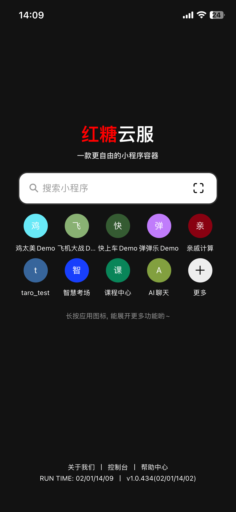
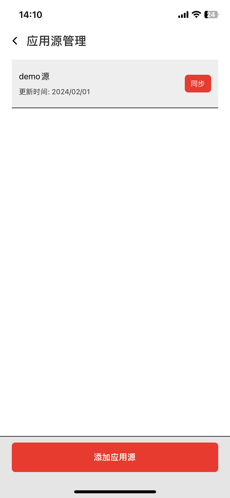

# 小程序app源

## [红糖云服app下载 https://mp.dagouzhi.com/ ](https://mp.dagouzhi.com/)

### 使用红糖云服app 加小程序源

> 
>
> https://raw.githubusercontent.com/htyf-mp-community/demo/main/apps.json

### 使用方法
| 1. 首页点加号  | 2. 系统管理 | 3. 源管理 |
| ------------- | ------------- | ------------- |
|  |  | 

## 此源包含小程序列表

| 小程序  | 二维码 |
| ------------- | ------------- |
| [动漫基地](https://share.dagouzhi.com/#/pages/index/index?data=%7B%22type%22%3A%22app%22%2C%22engines%22%3A%222.0.0%22%2C%22name%22%3A%22%E5%8A%A8%E6%BC%AB%E5%9F%BA%E5%9C%B0%22%2C%22appid%22%3A%22plugin_animation%22%2C%22version%22%3A%220.0.10%22%2C%22appUrlConfig%22%3A%22https%3A%2F%2Fraw.githubusercontent.com%2Fhtyf-mp-community%2Fdemo%2Fmain%2Fv2%2Fplugin_animation%2Flatest%2Fapp.json%22%2C%22zipUrl%22%3A%22https%3A%2F%2Fraw.githubusercontent.com%2Fhtyf-mp-community%2Fdemo%2Fmain%2Fv2%2Fplugin_animation%2Flatest%2Fdist.dgz%22%7D)  | [](https://share.dagouzhi.com/#/pages/index/index?data=%7B%22type%22%3A%22app%22%2C%22engines%22%3A%222.0.0%22%2C%22name%22%3A%22%E5%8A%A8%E6%BC%AB%E5%9F%BA%E5%9C%B0%22%2C%22appid%22%3A%22plugin_animation%22%2C%22version%22%3A%220.0.10%22%2C%22appUrlConfig%22%3A%22https%3A%2F%2Fraw.githubusercontent.com%2Fhtyf-mp-community%2Fdemo%2Fmain%2Fv2%2Fplugin_animation%2Flatest%2Fapp.json%22%2C%22zipUrl%22%3A%22https%3A%2F%2Fraw.githubusercontent.com%2Fhtyf-mp-community%2Fdemo%2Fmain%2Fv2%2Fplugin_animation%2Flatest%2Fdist.dgz%22%7D) |
| [godot](https://share.dagouzhi.com/#/pages/index/index?data=%7B%22type%22%3A%22app%22%2C%22engines%22%3A%222.0.0%22%2C%22name%22%3A%22godot%22%2C%22appid%22%3A%22plugin_godot%22%2C%22version%22%3A%220.0.4%22%2C%22appUrlConfig%22%3A%22https%3A%2F%2Fraw.githubusercontent.com%2Fhtyf-mp-community%2Fdemo%2Fmain%2Fv2%2Fplugin_godot%2Flatest%2Fapp.json%22%2C%22zipUrl%22%3A%22https%3A%2F%2Fraw.githubusercontent.com%2Fhtyf-mp-community%2Fdemo%2Fmain%2Fv2%2Fplugin_godot%2Flatest%2Fdist.dgz%22%7D)  |  |
| [直播基地](https://share.dagouzhi.com/#/pages/index/index?data=%7B%22type%22%3A%22app%22%2C%22engines%22%3A%222.0.0%22%2C%22name%22%3A%22%E7%9B%B4%E6%92%AD%E5%9F%BA%E5%9C%B0%22%2C%22appid%22%3A%22plugin_live%22%2C%22version%22%3A%220.0.18%22%2C%22appUrlConfig%22%3A%22https%3A%2F%2Fraw.githubusercontent.com%2Fhtyf-mp-community%2Fdemo%2Fmain%2Fv2%2Fplugin_live%2Flatest%2Fapp.json%22%2C%22zipUrl%22%3A%22https%3A%2F%2Fraw.githubusercontent.com%2Fhtyf-mp-community%2Fdemo%2Fmain%2Fv2%2Fplugin_live%2Flatest%2Fdist.dgz%22%7D)  |  |
| [漫画基地](https://share.dagouzhi.com/#/pages/index/index?data=%7B%22type%22%3A%22app%22%2C%22engines%22%3A%222.0.0%22%2C%22name%22%3A%22%E6%BC%AB%E7%94%BB%E5%9F%BA%E5%9C%B0%22%2C%22appid%22%3A%22plugin_manga%22%2C%22version%22%3A%220.0.21%22%2C%22appUrlConfig%22%3A%22https%3A%2F%2Fraw.githubusercontent.com%2Fhtyf-mp-community%2Fdemo%2Fmain%2Fv2%2Fplugin_manga%2Flatest%2Fapp.json%22%2C%22zipUrl%22%3A%22https%3A%2F%2Fraw.githubusercontent.com%2Fhtyf-mp-community%2Fdemo%2Fmain%2Fv2%2Fplugin_manga%2Flatest%2Fdist.dgz%22%7D)  | [](https://share.dagouzhi.com/#/pages/index/index?data=%7B%22type%22%3A%22app%22%2C%22engines%22%3A%222.0.0%22%2C%22name%22%3A%22%E6%BC%AB%E7%94%BB%E5%9F%BA%E5%9C%B0%22%2C%22appid%22%3A%22plugin_manga%22%2C%22version%22%3A%220.0.21%22%2C%22appUrlConfig%22%3A%22https%3A%2F%2Fraw.githubusercontent.com%2Fhtyf-mp-community%2Fdemo%2Fmain%2Fv2%2Fplugin_manga%2Flatest%2Fapp.json%22%2C%22zipUrl%22%3A%22https%3A%2F%2Fraw.githubusercontent.com%2Fhtyf-mp-community%2Fdemo%2Fmain%2Fv2%2Fplugin_manga%2Flatest%2Fdist.dgz%22%7D) |
| [影视基地](https://share.dagouzhi.com/#/pages/index/index?data=%7B%22type%22%3A%22app%22%2C%22engines%22%3A%222.0.0%22%2C%22name%22%3A%22%E5%BD%B1%E8%A7%86%E5%9F%BA%E5%9C%B0%22%2C%22appid%22%3A%22plugin_movie%22%2C%22version%22%3A%220.0.10%22%2C%22appUrlConfig%22%3A%22https%3A%2F%2Fraw.githubusercontent.com%2Fhtyf-mp-community%2Fdemo%2Fmain%2Fv2%2Fplugin_movie%2Flatest%2Fapp.json%22%2C%22zipUrl%22%3A%22https%3A%2F%2Fraw.githubusercontent.com%2Fhtyf-mp-community%2Fdemo%2Fmain%2Fv2%2Fplugin_movie%2Flatest%2Fdist.dgz%22%7D)  | [](https://share.dagouzhi.com/#/pages/index/index?data=%7B%22type%22%3A%22app%22%2C%22engines%22%3A%222.0.0%22%2C%22name%22%3A%22%E5%BD%B1%E8%A7%86%E5%9F%BA%E5%9C%B0%22%2C%22appid%22%3A%22plugin_movie%22%2C%22version%22%3A%220.0.10%22%2C%22appUrlConfig%22%3A%22https%3A%2F%2Fraw.githubusercontent.com%2Fhtyf-mp-community%2Fdemo%2Fmain%2Fv2%2Fplugin_movie%2Flatest%2Fapp.json%22%2C%22zipUrl%22%3A%22https%3A%2F%2Fraw.githubusercontent.com%2Fhtyf-mp-community%2Fdemo%2Fmain%2Fv2%2Fplugin_movie%2Flatest%2Fdist.dgz%22%7D) |
| [音乐基地](https://share.dagouzhi.com/#/pages/index/index?data=%7B%22type%22%3A%22app%22%2C%22engines%22%3A%222.0.0%22%2C%22name%22%3A%22%E9%9F%B3%E4%B9%90%E5%9F%BA%E5%9C%B0%22%2C%22appid%22%3A%22plugin_music%22%2C%22version%22%3A%220.0.13%22%2C%22appUrlConfig%22%3A%22https%3A%2F%2Fraw.githubusercontent.com%2Fhtyf-mp-community%2Fdemo%2Fmain%2Fv2%2Fplugin_music%2Flatest%2Fapp.json%22%2C%22zipUrl%22%3A%22https%3A%2F%2Fraw.githubusercontent.com%2Fhtyf-mp-community%2Fdemo%2Fmain%2Fv2%2Fplugin_music%2Flatest%2Fdist.dgz%22%7D)  | [](https://share.dagouzhi.com/#/pages/index/index?data=%7B%22type%22%3A%22app%22%2C%22engines%22%3A%222.0.0%22%2C%22name%22%3A%22%E9%9F%B3%E4%B9%90%E5%9F%BA%E5%9C%B0%22%2C%22appid%22%3A%22plugin_music%22%2C%22version%22%3A%220.0.13%22%2C%22appUrlConfig%22%3A%22https%3A%2F%2Fraw.githubusercontent.com%2Fhtyf-mp-community%2Fdemo%2Fmain%2Fv2%2Fplugin_music%2Flatest%2Fapp.json%22%2C%22zipUrl%22%3A%22https%3A%2F%2Fraw.githubusercontent.com%2Fhtyf-mp-community%2Fdemo%2Fmain%2Fv2%2Fplugin_music%2Flatest%2Fdist.dgz%22%7D) |
| [SDK](https://share.dagouzhi.com/#/pages/index/index?data=%7B%22type%22%3A%22app%22%2C%22engines%22%3A%222.0.0%22%2C%22name%22%3A%22SDK%22%2C%22appid%22%3A%22plugin_sdk%22%2C%22version%22%3A%220.0.44%22%2C%22appUrlConfig%22%3A%22https%3A%2F%2Fhongtangyun-1252095557.cos.accelerate.myqcloud.com%2Fassets%2FtestMiniApps%2Fappstore%2Fplugin%2Fsdk%2Flatest%2Fapp.json%22%2C%22zipUrl%22%3A%22https%3A%2F%2Fhongtangyun-1252095557.cos.accelerate.myqcloud.com%2Fassets%2FtestMiniApps%2Fappstore%2Fplugin%2Fsdk%2Flatest%2Fdist.dgz%22%7D)  | [](https://share.dagouzhi.com/#/pages/index/index?data=%7B%22type%22%3A%22app%22%2C%22engines%22%3A%222.0.0%22%2C%22name%22%3A%22SDK%22%2C%22appid%22%3A%22plugin_sdk%22%2C%22version%22%3A%220.0.44%22%2C%22appUrlConfig%22%3A%22https%3A%2F%2Fhongtangyun-1252095557.cos.accelerate.myqcloud.com%2Fassets%2FtestMiniApps%2Fappstore%2Fplugin%2Fsdk%2Flatest%2Fapp.json%22%2C%22zipUrl%22%3A%22https%3A%2F%2Fhongtangyun-1252095557.cos.accelerate.myqcloud.com%2Fassets%2FtestMiniApps%2Fappstore%2Fplugin%2Fsdk%2Flatest%2Fdist.dgz%22%7D) |
| [webgpu](https://share.dagouzhi.com/#/pages/index/index?data=%7B%22type%22%3A%22app%22%2C%22engines%22%3A%222.0.0%22%2C%22name%22%3A%22webgpu%22%2C%22appid%22%3A%22plugin_wgpu%22%2C%22version%22%3A%220.0.16%22%2C%22appUrlConfig%22%3A%22https%3A%2F%2Fraw.githubusercontent.com%2Fhtyf-mp-community%2Fdemo%2Fmain%2Fv2%2Fplugin_wgpu%2Flatest%2Fapp.json%22%2C%22zipUrl%22%3A%22https%3A%2F%2Fraw.githubusercontent.com%2Fhtyf-mp-community%2Fdemo%2Fmain%2Fv2%2Fplugin_wgpu%2Flatest%2Fdist.dgz%22%7D)  |  |

## 免责

1. 本项目所有数据信息均来自站长资源网站，本软件相当于浏览器，用户只是从网页中获取数据

2. 本项目承诺不保存任何第三方用户信息

3. 本项目代码仅供学习交流，不得用于商业用途，若侵权请联系

## 投食

开发迭代不易，觉得 App 好用的，有能力的请投喂一下，也可以给个星星

| 微信  | 支付宝 |
| ------------- | ------------- |
|   |  |
