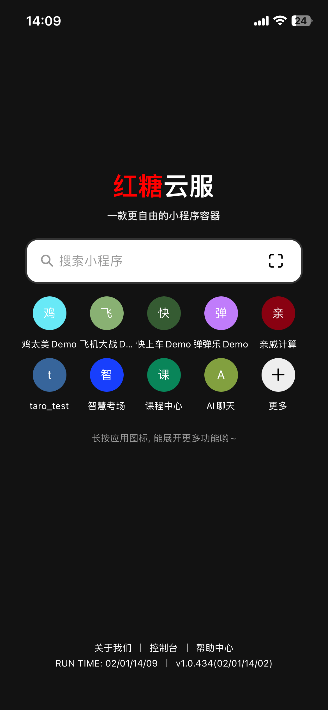
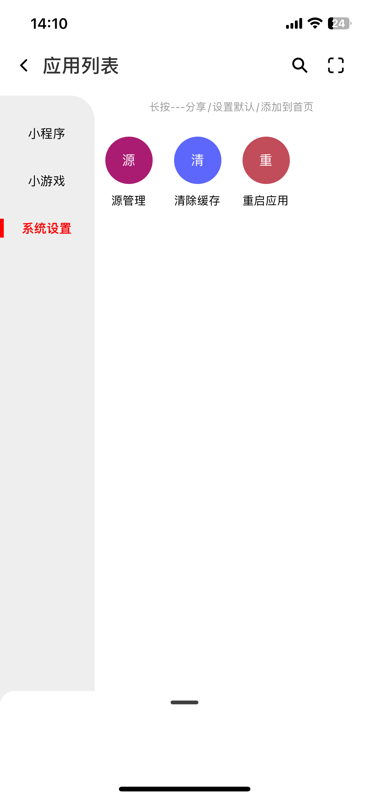
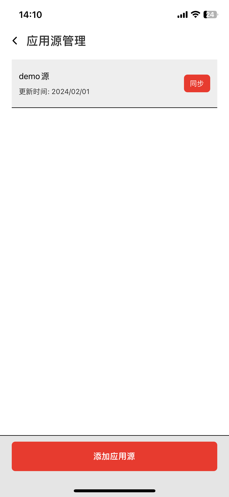

# 小程序app源

## [红糖云服app下载 https://mp.dagouzhi.com/ ](https://mp.dagouzhi.com/)

### 使用红糖云服app 加小程序源

> 
>
> https://raw.githubusercontent.com/htyf-mp-community/demo/main/apps.json

### 使用方法
| 1. 首页点加号  | 2. 系统管理 | 3. 源管理 |
| ------------- | ------------- | ------------- |
|  |  | 

## 此源包含小程序列表

| 小程序  | 二维码 |
| ------------- | ------------- |
| [勇者](https://mp.dagouzhi.com/share?data=%7B%22type%22%3A%22game%22%2C%22rotate%22%3A%22landscape%22%2C%22name%22%3A%22%E5%8B%87%E8%80%85%22%2C%22projectname%22%3A%22%E5%8B%87%E8%80%85%22%2C%22appid%22%3A%22fe27d0d96e8fe86bce2eb341386c9f37%22%2C%22appUrlConfig%22%3A%22https%3A%2F%2Fhongtangyun-1252095557.cos.ap-chengdu.myqcloud.com%2Fassets%2FtestMiniApps%2Fappstore%2Fplugin%2Fgame%2Fapp.json%22%2C%22zipUrl%22%3A%22https%3A%2F%2Fhongtangyun-1252095557.cos.ap-chengdu.myqcloud.com%2Fassets%2FtestMiniApps%2Fappstore%2Fplugin%2Fgame%2Fdist.%5BPLATFORM%5D.dgz%22%2C%22version%22%3A%221.0.53%22%2C%22engines%22%3A%222.0.0%22%7D)  | [](https://mp.dagouzhi.com/share?data=%7B%22type%22%3A%22game%22%2C%22rotate%22%3A%22landscape%22%2C%22name%22%3A%22%E5%8B%87%E8%80%85%22%2C%22projectname%22%3A%22%E5%8B%87%E8%80%85%22%2C%22appid%22%3A%22fe27d0d96e8fe86bce2eb341386c9f37%22%2C%22appUrlConfig%22%3A%22https%3A%2F%2Fhongtangyun-1252095557.cos.ap-chengdu.myqcloud.com%2Fassets%2FtestMiniApps%2Fappstore%2Fplugin%2Fgame%2Fapp.json%22%2C%22zipUrl%22%3A%22https%3A%2F%2Fhongtangyun-1252095557.cos.ap-chengdu.myqcloud.com%2Fassets%2FtestMiniApps%2Fappstore%2Fplugin%2Fgame%2Fdist.%5BPLATFORM%5D.dgz%22%2C%22version%22%3A%221.0.53%22%2C%22engines%22%3A%222.0.0%22%7D) |
| [Brotato](https://mp.dagouzhi.com/share?data=%7B%22type%22%3A%22game%22%2C%22name%22%3A%22Brotato%22%2C%22version%22%3A%220.0.2%22%2C%22appid%22%3A%22htyfappf49da0bb73f392e688e9754211%22%2C%22rotate%22%3A%22landscape%22%2C%22appUrlConfig%22%3A%22https%3A%2F%2Fhongtangyun-1252095557.cos.ap-chengdu.myqcloud.com%2Fassets%2FtestMiniApps%2Fappstore%2Fplugin%2Fgame-brotato%2Fapp.json%22%2C%22zipUrl%22%3A%22https%3A%2F%2Fhongtangyun-1252095557.cos.ap-chengdu.myqcloud.com%2Fassets%2FtestMiniApps%2Fappstore%2Fplugin%2Fgame-brotato%2Fdist.%5BPLATFORM%5D.dgz%22%2C%22projectname%22%3A%22%E5%B0%8F%E7%A8%8B%E5%BA%8F%22%2C%22engines%22%3A%222.0.0%22%7D)  | [](https://mp.dagouzhi.com/share?data=%7B%22type%22%3A%22game%22%2C%22name%22%3A%22Brotato%22%2C%22version%22%3A%220.0.2%22%2C%22appid%22%3A%22htyfappf49da0bb73f392e688e9754211%22%2C%22rotate%22%3A%22landscape%22%2C%22appUrlConfig%22%3A%22https%3A%2F%2Fhongtangyun-1252095557.cos.ap-chengdu.myqcloud.com%2Fassets%2FtestMiniApps%2Fappstore%2Fplugin%2Fgame-brotato%2Fapp.json%22%2C%22zipUrl%22%3A%22https%3A%2F%2Fhongtangyun-1252095557.cos.ap-chengdu.myqcloud.com%2Fassets%2FtestMiniApps%2Fappstore%2Fplugin%2Fgame-brotato%2Fdist.%5BPLATFORM%5D.dgz%22%2C%22projectname%22%3A%22%E5%B0%8F%E7%A8%8B%E5%BA%8F%22%2C%22engines%22%3A%222.0.0%22%7D) |
| [ccfish](https://mp.dagouzhi.com/share?data=%7B%22type%22%3A%22game%22%2C%22name%22%3A%22ccfish%22%2C%22version%22%3A%221.0.5%22%2C%22appid%22%3A%22htyfappa86ac64068242ebaa382becfc52f6de4%22%2C%22rotate%22%3A%22landscape%22%2C%22appUrlConfig%22%3A%22https%3A%2F%2Fhongtangyun-1252095557.cos.ap-chengdu.myqcloud.com%2Fassets%2Fgame%2Fccfish%2Flatest%2Fapp.json%22%2C%22zipUrl%22%3A%22https%3A%2F%2Fhongtangyun-1252095557.cos.ap-chengdu.myqcloud.com%2Fassets%2Fgame%2Fccfish%2Flatest%2Fdist.%5BPLATFORM%5D.dgz%22%2C%22projectname%22%3A%22%E6%8D%95%E9%B1%BC%E8%BE%BE%E4%BA%BA%22%2C%22engines%22%3A%222.0.0%22%7D)  | [](https://mp.dagouzhi.com/share?data=%7B%22type%22%3A%22game%22%2C%22name%22%3A%22ccfish%22%2C%22version%22%3A%221.0.5%22%2C%22appid%22%3A%22htyfappa86ac64068242ebaa382becfc52f6de4%22%2C%22rotate%22%3A%22landscape%22%2C%22appUrlConfig%22%3A%22https%3A%2F%2Fhongtangyun-1252095557.cos.ap-chengdu.myqcloud.com%2Fassets%2Fgame%2Fccfish%2Flatest%2Fapp.json%22%2C%22zipUrl%22%3A%22https%3A%2F%2Fhongtangyun-1252095557.cos.ap-chengdu.myqcloud.com%2Fassets%2Fgame%2Fccfish%2Flatest%2Fdist.%5BPLATFORM%5D.dgz%22%2C%22projectname%22%3A%22%E6%8D%95%E9%B1%BC%E8%BE%BE%E4%BA%BA%22%2C%22engines%22%3A%222.0.0%22%7D) |
| [cloudwake](https://mp.dagouzhi.com/share?data=%7B%22type%22%3A%22game%22%2C%22name%22%3A%22cloudwake%22%2C%22version%22%3A%220.3.3%22%2C%22appid%22%3A%22htyfapp753a157e01067c482d141447eb042098%22%2C%22rotate%22%3A%22landscape%22%2C%22appUrlConfig%22%3A%22https%3A%2F%2Fhongtangyun-1252095557.cos.ap-chengdu.myqcloud.com%2Fassets%2Fgame%2Fcloudwake%2Flatest%2Fapp.json%22%2C%22zipUrl%22%3A%22https%3A%2F%2Fhongtangyun-1252095557.cos.ap-chengdu.myqcloud.com%2Fassets%2Fgame%2Fcloudwake%2Flatest%2Fdist.%5BPLATFORM%5D.dgz%22%2C%22projectname%22%3A%22%E4%BA%91%E8%88%9F%E6%BC%82%E6%B5%81%E8%AE%B0%22%2C%22engines%22%3A%222.0.0%22%7D)  | [](https://mp.dagouzhi.com/share?data=%7B%22type%22%3A%22game%22%2C%22name%22%3A%22cloudwake%22%2C%22version%22%3A%220.3.3%22%2C%22appid%22%3A%22htyfapp753a157e01067c482d141447eb042098%22%2C%22rotate%22%3A%22landscape%22%2C%22appUrlConfig%22%3A%22https%3A%2F%2Fhongtangyun-1252095557.cos.ap-chengdu.myqcloud.com%2Fassets%2Fgame%2Fcloudwake%2Flatest%2Fapp.json%22%2C%22zipUrl%22%3A%22https%3A%2F%2Fhongtangyun-1252095557.cos.ap-chengdu.myqcloud.com%2Fassets%2Fgame%2Fcloudwake%2Flatest%2Fdist.%5BPLATFORM%5D.dgz%22%2C%22projectname%22%3A%22%E4%BA%91%E8%88%9F%E6%BC%82%E6%B5%81%E8%AE%B0%22%2C%22engines%22%3A%222.0.0%22%7D) |
| [dont-stop](https://mp.dagouzhi.com/share?data=%7B%22type%22%3A%22game%22%2C%22name%22%3A%22dont-stop%22%2C%22version%22%3A%221.0.3%22%2C%22appid%22%3A%22htyfapp6f1778629eea55011671ae43cc7f893c%22%2C%22rotate%22%3A%22landscape%22%2C%22appUrlConfig%22%3A%22https%3A%2F%2Fhongtangyun-1252095557.cos.ap-chengdu.myqcloud.com%2Fassets%2Fgame%2Fdont-stop%2Flatest%2Fapp.json%22%2C%22zipUrl%22%3A%22https%3A%2F%2Fhongtangyun-1252095557.cos.ap-chengdu.myqcloud.com%2Fassets%2Fgame%2Fdont-stop%2Flatest%2Fdist.%5BPLATFORM%5D.dgz%22%2C%22projectname%22%3A%22%E4%B8%8D%E8%A6%81%E5%81%9C%E4%B8%8B%22%2C%22engines%22%3A%222.0.0%22%7D)  | [](https://mp.dagouzhi.com/share?data=%7B%22type%22%3A%22game%22%2C%22name%22%3A%22dont-stop%22%2C%22version%22%3A%221.0.3%22%2C%22appid%22%3A%22htyfapp6f1778629eea55011671ae43cc7f893c%22%2C%22rotate%22%3A%22landscape%22%2C%22appUrlConfig%22%3A%22https%3A%2F%2Fhongtangyun-1252095557.cos.ap-chengdu.myqcloud.com%2Fassets%2Fgame%2Fdont-stop%2Flatest%2Fapp.json%22%2C%22zipUrl%22%3A%22https%3A%2F%2Fhongtangyun-1252095557.cos.ap-chengdu.myqcloud.com%2Fassets%2Fgame%2Fdont-stop%2Flatest%2Fdist.%5BPLATFORM%5D.dgz%22%2C%22projectname%22%3A%22%E4%B8%8D%E8%A6%81%E5%81%9C%E4%B8%8B%22%2C%22engines%22%3A%222.0.0%22%7D) |
| [逃出地下城](https://mp.dagouzhi.com/share?data=%7B%22type%22%3A%22game%22%2C%22name%22%3A%22%E9%80%83%E5%87%BA%E5%9C%B0%E4%B8%8B%E5%9F%8E%22%2C%22version%22%3A%221.0.45%22%2C%22appid%22%3A%22htyfapp2063ea1283cd93f998c94f47431ce3de%22%2C%22rotate%22%3A%22portrait%22%2C%22appUrlConfig%22%3A%22https%3A%2F%2Fhongtangyun-1252095557.cos.ap-chengdu.myqcloud.com%2Fassets%2Fgame%2Fescape-dungeon%2Flatest%2Fapp.json%22%2C%22zipUrl%22%3A%22https%3A%2F%2Fhongtangyun-1252095557.cos.ap-chengdu.myqcloud.com%2Fassets%2Fgame%2Fescape-dungeon%2Flatest%2Fdist.%5BPLATFORM%5D.dgz%22%2C%22projectname%22%3A%22%E9%80%83%E5%87%BA%E5%9C%B0%E4%B8%8B%E5%9F%8E%22%2C%22engines%22%3A%222.0.0%22%7D)  | [](https://mp.dagouzhi.com/share?data=%7B%22type%22%3A%22game%22%2C%22name%22%3A%22%E9%80%83%E5%87%BA%E5%9C%B0%E4%B8%8B%E5%9F%8E%22%2C%22version%22%3A%221.0.45%22%2C%22appid%22%3A%22htyfapp2063ea1283cd93f998c94f47431ce3de%22%2C%22rotate%22%3A%22portrait%22%2C%22appUrlConfig%22%3A%22https%3A%2F%2Fhongtangyun-1252095557.cos.ap-chengdu.myqcloud.com%2Fassets%2Fgame%2Fescape-dungeon%2Flatest%2Fapp.json%22%2C%22zipUrl%22%3A%22https%3A%2F%2Fhongtangyun-1252095557.cos.ap-chengdu.myqcloud.com%2Fassets%2Fgame%2Fescape-dungeon%2Flatest%2Fdist.%5BPLATFORM%5D.dgz%22%2C%22projectname%22%3A%22%E9%80%83%E5%87%BA%E5%9C%B0%E4%B8%8B%E5%9F%8E%22%2C%22engines%22%3A%222.0.0%22%7D) |
| [pvz-dream](https://mp.dagouzhi.com/share?data=%7B%22type%22%3A%22game%22%2C%22name%22%3A%22pvz-dream%22%2C%22version%22%3A%221.0.4%22%2C%22appid%22%3A%22htyfapp73e807043bf6b6710dfbcc1d144370b0%22%2C%22rotate%22%3A%22landscape%22%2C%22appUrlConfig%22%3A%22https%3A%2F%2Fhongtangyun-1252095557.cos.ap-chengdu.myqcloud.com%2Fassets%2Fgame%2Fpvz-dream%2Flatest%2Fapp.json%22%2C%22zipUrl%22%3A%22https%3A%2F%2Fhongtangyun-1252095557.cos.ap-chengdu.myqcloud.com%2Fassets%2Fgame%2Fpvz-dream%2Flatest%2Fdist.%5BPLATFORM%5D.dgz%22%2C%22projectname%22%3A%22%E6%A4%8D%E7%89%A9%E6%A2%A6%E5%A2%83%22%2C%22engines%22%3A%222.0.0%22%7D)  | [](https://mp.dagouzhi.com/share?data=%7B%22type%22%3A%22game%22%2C%22name%22%3A%22pvz-dream%22%2C%22version%22%3A%221.0.4%22%2C%22appid%22%3A%22htyfapp73e807043bf6b6710dfbcc1d144370b0%22%2C%22rotate%22%3A%22landscape%22%2C%22appUrlConfig%22%3A%22https%3A%2F%2Fhongtangyun-1252095557.cos.ap-chengdu.myqcloud.com%2Fassets%2Fgame%2Fpvz-dream%2Flatest%2Fapp.json%22%2C%22zipUrl%22%3A%22https%3A%2F%2Fhongtangyun-1252095557.cos.ap-chengdu.myqcloud.com%2Fassets%2Fgame%2Fpvz-dream%2Flatest%2Fdist.%5BPLATFORM%5D.dgz%22%2C%22projectname%22%3A%22%E6%A4%8D%E7%89%A9%E6%A2%A6%E5%A2%83%22%2C%22engines%22%3A%222.0.0%22%7D) |
| [super-dungeon-delve](https://mp.dagouzhi.com/share?data=%7B%22type%22%3A%22game%22%2C%22name%22%3A%22super-dungeon-delve%22%2C%22version%22%3A%221.0.5%22%2C%22appid%22%3A%22htyfapp94a9a4080695b2442ced1cf388b3d477%22%2C%22rotate%22%3A%22landscape%22%2C%22appUrlConfig%22%3A%22https%3A%2F%2Fhongtangyun-1252095557.cos.ap-chengdu.myqcloud.com%2Fassets%2Fgame%2Fsuper-dungeon-delve%2Flatest%2Fapp.json%22%2C%22zipUrl%22%3A%22https%3A%2F%2Fhongtangyun-1252095557.cos.ap-chengdu.myqcloud.com%2Fassets%2Fgame%2Fsuper-dungeon-delve%2Flatest%2Fdist.%5BPLATFORM%5D.dgz%22%2C%22projectname%22%3A%22%E8%B6%85%E7%BA%A7%E5%9C%B0%E7%89%A2%22%2C%22engines%22%3A%222.0.0%22%7D)  | [](https://mp.dagouzhi.com/share?data=%7B%22type%22%3A%22game%22%2C%22name%22%3A%22super-dungeon-delve%22%2C%22version%22%3A%221.0.5%22%2C%22appid%22%3A%22htyfapp94a9a4080695b2442ced1cf388b3d477%22%2C%22rotate%22%3A%22landscape%22%2C%22appUrlConfig%22%3A%22https%3A%2F%2Fhongtangyun-1252095557.cos.ap-chengdu.myqcloud.com%2Fassets%2Fgame%2Fsuper-dungeon-delve%2Flatest%2Fapp.json%22%2C%22zipUrl%22%3A%22https%3A%2F%2Fhongtangyun-1252095557.cos.ap-chengdu.myqcloud.com%2Fassets%2Fgame%2Fsuper-dungeon-delve%2Flatest%2Fdist.%5BPLATFORM%5D.dgz%22%2C%22projectname%22%3A%22%E8%B6%85%E7%BA%A7%E5%9C%B0%E7%89%A2%22%2C%22engines%22%3A%222.0.0%22%7D) |
| [动漫基地](https://mp.dagouzhi.com/share?data=%7B%22type%22%3A%22app%22%2C%22entry%22%3A%22.%2Fsrc%2Findex.tsx%22%2C%22version%22%3A%221.0.25%22%2C%22name%22%3A%22%E5%8A%A8%E6%BC%AB%E5%9F%BA%E5%9C%B0%22%2C%22appid%22%3A%22plugin_animation%22%2C%22rotate%22%3A%22portrait%22%2C%22appUrlConfig%22%3A%22https%3A%2F%2Fraw.githubusercontent.com%2Fhtyf-mp-community%2Fdemo%2Fmain%2Fv2%2Fplugin_animation%2Flatest%2Fapp.json%22%2C%22zipUrl%22%3A%22https%3A%2F%2Fraw.githubusercontent.com%2Fhtyf-mp-community%2Fdemo%2Fmain%2Fv2%2Fplugin_animation%2Flatest%2Fdist.dgz%22%2C%22projectname%22%3A%22%E5%8A%A8%E6%BC%AB%E5%9F%BA%E5%9C%B0%22%2C%22engines%22%3A%222.0.0%22%7D)  | [](https://mp.dagouzhi.com/share?data=%7B%22type%22%3A%22app%22%2C%22entry%22%3A%22.%2Fsrc%2Findex.tsx%22%2C%22version%22%3A%221.0.25%22%2C%22name%22%3A%22%E5%8A%A8%E6%BC%AB%E5%9F%BA%E5%9C%B0%22%2C%22appid%22%3A%22plugin_animation%22%2C%22rotate%22%3A%22portrait%22%2C%22appUrlConfig%22%3A%22https%3A%2F%2Fraw.githubusercontent.com%2Fhtyf-mp-community%2Fdemo%2Fmain%2Fv2%2Fplugin_animation%2Flatest%2Fapp.json%22%2C%22zipUrl%22%3A%22https%3A%2F%2Fraw.githubusercontent.com%2Fhtyf-mp-community%2Fdemo%2Fmain%2Fv2%2Fplugin_animation%2Flatest%2Fdist.dgz%22%2C%22projectname%22%3A%22%E5%8A%A8%E6%BC%AB%E5%9F%BA%E5%9C%B0%22%2C%22engines%22%3A%222.0.0%22%7D) |
| [Kazumi](https://mp.dagouzhi.com/share?data=%7B%22type%22%3A%22app%22%2C%22entry%22%3A%22.%2Fsrc%2Findex.tsx%22%2C%22version%22%3A%221.0.28%22%2C%22name%22%3A%22Kazumi%22%2C%22appid%22%3A%22htyfappfdee60c7512d0b292a63f252e8e64f16%22%2C%22rotate%22%3A%22portrait%22%2C%22appUrlConfig%22%3A%22https%3A%2F%2Fraw.githubusercontent.com%2Fhtyf-mp-community%2Fdemo%2Fmain%2Fv2%2Fplugin_kazumi%2Flatest%2Fapp.json%22%2C%22zipUrl%22%3A%22https%3A%2F%2Fraw.githubusercontent.com%2Fhtyf-mp-community%2Fdemo%2Fmain%2Fv2%2Fplugin_kazumi%2Flatest%2Fdist.dgz%22%2C%22projectname%22%3A%22%E5%B0%8F%E7%A8%8B%E5%BA%8F%22%2C%22engines%22%3A%222.0.0%22%7D)  | [](https://mp.dagouzhi.com/share?data=%7B%22type%22%3A%22app%22%2C%22entry%22%3A%22.%2Fsrc%2Findex.tsx%22%2C%22version%22%3A%221.0.28%22%2C%22name%22%3A%22Kazumi%22%2C%22appid%22%3A%22htyfappfdee60c7512d0b292a63f252e8e64f16%22%2C%22rotate%22%3A%22portrait%22%2C%22appUrlConfig%22%3A%22https%3A%2F%2Fraw.githubusercontent.com%2Fhtyf-mp-community%2Fdemo%2Fmain%2Fv2%2Fplugin_kazumi%2Flatest%2Fapp.json%22%2C%22zipUrl%22%3A%22https%3A%2F%2Fraw.githubusercontent.com%2Fhtyf-mp-community%2Fdemo%2Fmain%2Fv2%2Fplugin_kazumi%2Flatest%2Fdist.dgz%22%2C%22projectname%22%3A%22%E5%B0%8F%E7%A8%8B%E5%BA%8F%22%2C%22engines%22%3A%222.0.0%22%7D) |
| [Legado](https://mp.dagouzhi.com/share?data=%7B%22type%22%3A%22app%22%2C%22entry%22%3A%22.%2Fsrc%2Findex.tsx%22%2C%22version%22%3A%220.0.12%22%2C%22name%22%3A%22Legado%22%2C%22appid%22%3A%22plugin_legado%22%2C%22rotate%22%3A%22auto%22%2C%22appUrlConfig%22%3A%22https%3A%2F%2Fraw.githubusercontent.com%2Fhtyf-mp-community%2Fdemo%2Fmain%2Fv2%2Fplugin_legado%2Flatest%2Fapp.json%22%2C%22zipUrl%22%3A%22https%3A%2F%2Fraw.githubusercontent.com%2Fhtyf-mp-community%2Fdemo%2Fmain%2Fv2%2Fplugin_legado%2Flatest%2Fdist.dgz%22%2C%22projectname%22%3A%22%E5%B0%8F%E7%A8%8B%E5%BA%8F%22%2C%22engines%22%3A%222.0.0%22%7D)  | [](https://mp.dagouzhi.com/share?data=%7B%22type%22%3A%22app%22%2C%22entry%22%3A%22.%2Fsrc%2Findex.tsx%22%2C%22version%22%3A%220.0.12%22%2C%22name%22%3A%22Legado%22%2C%22appid%22%3A%22plugin_legado%22%2C%22rotate%22%3A%22auto%22%2C%22appUrlConfig%22%3A%22https%3A%2F%2Fraw.githubusercontent.com%2Fhtyf-mp-community%2Fdemo%2Fmain%2Fv2%2Fplugin_legado%2Flatest%2Fapp.json%22%2C%22zipUrl%22%3A%22https%3A%2F%2Fraw.githubusercontent.com%2Fhtyf-mp-community%2Fdemo%2Fmain%2Fv2%2Fplugin_legado%2Flatest%2Fdist.dgz%22%2C%22projectname%22%3A%22%E5%B0%8F%E7%A8%8B%E5%BA%8F%22%2C%22engines%22%3A%222.0.0%22%7D) |
| [SimpleLive](https://mp.dagouzhi.com/share?data=%7B%22type%22%3A%22app%22%2C%22entry%22%3A%22.%2Fsrc%2Findex.tsx%22%2C%22version%22%3A%221.0.46%22%2C%22name%22%3A%22SimpleLive%22%2C%22appid%22%3A%22plugin_live%22%2C%22rotate%22%3A%22portrait%22%2C%22appUrlConfig%22%3A%22https%3A%2F%2Fraw.githubusercontent.com%2Fhtyf-mp-community%2Fdemo%2Fmain%2Fv2%2Fplugin_live%2Flatest%2Fapp.json%22%2C%22zipUrl%22%3A%22https%3A%2F%2Fraw.githubusercontent.com%2Fhtyf-mp-community%2Fdemo%2Fmain%2Fv2%2Fplugin_live%2Flatest%2Fdist.dgz%22%2C%22projectname%22%3A%22SimpleLive%22%2C%22engines%22%3A%222.0.0%22%7D)  | [](https://mp.dagouzhi.com/share?data=%7B%22type%22%3A%22app%22%2C%22entry%22%3A%22.%2Fsrc%2Findex.tsx%22%2C%22version%22%3A%221.0.46%22%2C%22name%22%3A%22SimpleLive%22%2C%22appid%22%3A%22plugin_live%22%2C%22rotate%22%3A%22portrait%22%2C%22appUrlConfig%22%3A%22https%3A%2F%2Fraw.githubusercontent.com%2Fhtyf-mp-community%2Fdemo%2Fmain%2Fv2%2Fplugin_live%2Flatest%2Fapp.json%22%2C%22zipUrl%22%3A%22https%3A%2F%2Fraw.githubusercontent.com%2Fhtyf-mp-community%2Fdemo%2Fmain%2Fv2%2Fplugin_live%2Flatest%2Fdist.dgz%22%2C%22projectname%22%3A%22SimpleLive%22%2C%22engines%22%3A%222.0.0%22%7D) |
| [MangaReader](https://mp.dagouzhi.com/share?data=%7B%22type%22%3A%22app%22%2C%22entry%22%3A%22.%2Fsrc%2Findex.tsx%22%2C%22version%22%3A%220.0.73%22%2C%22name%22%3A%22MangaReader%22%2C%22appid%22%3A%22plugin_manga%22%2C%22rotate%22%3A%22portrait%22%2C%22appUrlConfig%22%3A%22https%3A%2F%2Fraw.githubusercontent.com%2Fhtyf-mp-community%2Fdemo%2Fmain%2Fv2%2Fplugin_manga%2Flatest%2Fapp.json%22%2C%22zipUrl%22%3A%22https%3A%2F%2Fraw.githubusercontent.com%2Fhtyf-mp-community%2Fdemo%2Fmain%2Fv2%2Fplugin_manga%2Flatest%2Fdist.dgz%22%2C%22projectname%22%3A%22MangaReader%22%2C%22engines%22%3A%222.0.0%22%7D)  | [](https://mp.dagouzhi.com/share?data=%7B%22type%22%3A%22app%22%2C%22entry%22%3A%22.%2Fsrc%2Findex.tsx%22%2C%22version%22%3A%220.0.73%22%2C%22name%22%3A%22MangaReader%22%2C%22appid%22%3A%22plugin_manga%22%2C%22rotate%22%3A%22portrait%22%2C%22appUrlConfig%22%3A%22https%3A%2F%2Fraw.githubusercontent.com%2Fhtyf-mp-community%2Fdemo%2Fmain%2Fv2%2Fplugin_manga%2Flatest%2Fapp.json%22%2C%22zipUrl%22%3A%22https%3A%2F%2Fraw.githubusercontent.com%2Fhtyf-mp-community%2Fdemo%2Fmain%2Fv2%2Fplugin_manga%2Flatest%2Fdist.dgz%22%2C%22projectname%22%3A%22MangaReader%22%2C%22engines%22%3A%222.0.0%22%7D) |
| [影视基地](https://mp.dagouzhi.com/share?data=%7B%22type%22%3A%22app%22%2C%22entry%22%3A%22.%2Fsrc%2Findex.tsx%22%2C%22version%22%3A%221.0.25%22%2C%22name%22%3A%22%E5%BD%B1%E8%A7%86%E5%9F%BA%E5%9C%B0%22%2C%22appid%22%3A%22plugin_movie%22%2C%22rotate%22%3A%22portrait%22%2C%22appUrlConfig%22%3A%22https%3A%2F%2Fraw.githubusercontent.com%2Fhtyf-mp-community%2Fdemo%2Fmain%2Fv2%2Fplugin_movie%2Flatest%2Fapp.json%22%2C%22zipUrl%22%3A%22https%3A%2F%2Fraw.githubusercontent.com%2Fhtyf-mp-community%2Fdemo%2Fmain%2Fv2%2Fplugin_movie%2Flatest%2Fdist.dgz%22%2C%22projectname%22%3A%22%E5%8A%A8%E6%BC%AB%E5%9F%BA%E5%9C%B0%22%2C%22engines%22%3A%222.0.0%22%7D)  | [](https://mp.dagouzhi.com/share?data=%7B%22type%22%3A%22app%22%2C%22entry%22%3A%22.%2Fsrc%2Findex.tsx%22%2C%22version%22%3A%221.0.25%22%2C%22name%22%3A%22%E5%BD%B1%E8%A7%86%E5%9F%BA%E5%9C%B0%22%2C%22appid%22%3A%22plugin_movie%22%2C%22rotate%22%3A%22portrait%22%2C%22appUrlConfig%22%3A%22https%3A%2F%2Fraw.githubusercontent.com%2Fhtyf-mp-community%2Fdemo%2Fmain%2Fv2%2Fplugin_movie%2Flatest%2Fapp.json%22%2C%22zipUrl%22%3A%22https%3A%2F%2Fraw.githubusercontent.com%2Fhtyf-mp-community%2Fdemo%2Fmain%2Fv2%2Fplugin_movie%2Flatest%2Fdist.dgz%22%2C%22projectname%22%3A%22%E5%8A%A8%E6%BC%AB%E5%9F%BA%E5%9C%B0%22%2C%22engines%22%3A%222.0.0%22%7D) |
| [MusicFree](https://mp.dagouzhi.com/share?data=%7B%22type%22%3A%22app%22%2C%22entry%22%3A%22.%2Fsrc%2Findex.tsx%22%2C%22version%22%3A%220.0.62%22%2C%22name%22%3A%22MusicFree%22%2C%22appid%22%3A%22plugin_music%22%2C%22rotate%22%3A%22portrait%22%2C%22appUrlConfig%22%3A%22https%3A%2F%2Fraw.githubusercontent.com%2Fhtyf-mp-community%2Fdemo%2Fmain%2Fv2%2Fplugin_music%2Flatest%2Fapp.json%22%2C%22zipUrl%22%3A%22https%3A%2F%2Fraw.githubusercontent.com%2Fhtyf-mp-community%2Fdemo%2Fmain%2Fv2%2Fplugin_music%2Flatest%2Fdist.dgz%22%2C%22projectname%22%3A%22MusicFree%22%2C%22engines%22%3A%222.0.0%22%7D)  | [](https://mp.dagouzhi.com/share?data=%7B%22type%22%3A%22app%22%2C%22entry%22%3A%22.%2Fsrc%2Findex.tsx%22%2C%22version%22%3A%220.0.62%22%2C%22name%22%3A%22MusicFree%22%2C%22appid%22%3A%22plugin_music%22%2C%22rotate%22%3A%22portrait%22%2C%22appUrlConfig%22%3A%22https%3A%2F%2Fraw.githubusercontent.com%2Fhtyf-mp-community%2Fdemo%2Fmain%2Fv2%2Fplugin_music%2Flatest%2Fapp.json%22%2C%22zipUrl%22%3A%22https%3A%2F%2Fraw.githubusercontent.com%2Fhtyf-mp-community%2Fdemo%2Fmain%2Fv2%2Fplugin_music%2Flatest%2Fdist.dgz%22%2C%22projectname%22%3A%22MusicFree%22%2C%22engines%22%3A%222.0.0%22%7D) |
| [SDK](https://mp.dagouzhi.com/share?data=%7B%22type%22%3A%22app%22%2C%22entry%22%3A%22.%2Fsrc%2Findex.tsx%22%2C%22version%22%3A%221.0.39%22%2C%22name%22%3A%22SDK%22%2C%22appid%22%3A%22plugin_sdk%22%2C%22rotate%22%3A%22portrait%22%2C%22appUrlConfig%22%3A%22https%3A%2F%2Fhongtangyun-1252095557.cos.accelerate.myqcloud.com%2Fassets%2FtestMiniApps%2Fappstore%2Fplugin%2Fsdk%2Flatest%2F%2Fapp.json%22%2C%22zipUrl%22%3A%22https%3A%2F%2Fhongtangyun-1252095557.cos.accelerate.myqcloud.com%2Fassets%2FtestMiniApps%2Fappstore%2Fplugin%2Fsdk%2Flatest%2F%2Fdist.dgz%22%2C%22projectname%22%3A%22%E5%B0%8F%E7%A8%8B%E5%BA%8F%22%2C%22engines%22%3A%222.0.0%22%7D)  | [](https://mp.dagouzhi.com/share?data=%7B%22type%22%3A%22app%22%2C%22entry%22%3A%22.%2Fsrc%2Findex.tsx%22%2C%22version%22%3A%221.0.39%22%2C%22name%22%3A%22SDK%22%2C%22appid%22%3A%22plugin_sdk%22%2C%22rotate%22%3A%22portrait%22%2C%22appUrlConfig%22%3A%22https%3A%2F%2Fhongtangyun-1252095557.cos.accelerate.myqcloud.com%2Fassets%2FtestMiniApps%2Fappstore%2Fplugin%2Fsdk%2Flatest%2F%2Fapp.json%22%2C%22zipUrl%22%3A%22https%3A%2F%2Fhongtangyun-1252095557.cos.accelerate.myqcloud.com%2Fassets%2FtestMiniApps%2Fappstore%2Fplugin%2Fsdk%2Flatest%2F%2Fdist.dgz%22%2C%22projectname%22%3A%22%E5%B0%8F%E7%A8%8B%E5%BA%8F%22%2C%22engines%22%3A%222.0.0%22%7D) |
| [Taro](https://mp.dagouzhi.com/share?data=%7B%22type%22%3A%22app%22%2C%22engines%22%3A%222.0.0%22%2C%22name%22%3A%22Taro%22%2C%22appid%22%3A%22plugin_taro%22%2C%22version%22%3A%220.0.4%22%2C%22appUrlConfig%22%3A%22https%3A%2F%2Fhongtangyun-1252095557.cos.accelerate.myqcloud.com%2Fassets%2FtestMiniApps%2Fappstore%2Fplugin%2Ftaro%2Flatest%2Fapp.json%22%2C%22zipUrl%22%3A%22https%3A%2F%2Fhongtangyun-1252095557.cos.accelerate.myqcloud.com%2Fassets%2FtestMiniApps%2Fappstore%2Fplugin%2Ftaro%2Flatest%2Fdist.dgz%22%7D)  |  |
| [taro_ui](https://mp.dagouzhi.com/share?data=%7B%22rotate%22%3A%22portrait%22%2C%22type%22%3A%22app%22%2C%22engines%22%3A%222.0.0%22%2C%22name%22%3A%22taro_ui%22%2C%22appid%22%3A%22htyf565635841f9879d4%22%2C%22version%22%3A%221.0.2%22%2C%22appUrlConfig%22%3A%22https%3A%2F%2Fraw.githubusercontent.com%2Fhtyf-mp-community%2Fdemo%2Fmain%2Fv2%2Fplugin_taro_ui%2Flatest%2Fapp.json%22%2C%22zipUrl%22%3A%22https%3A%2F%2Fraw.githubusercontent.com%2Fhtyf-mp-community%2Fdemo%2Fmain%2Fv2%2Fplugin_taro_ui%2Flatest%2Fdist.dgz%22%7D)  |  |
| [web_demo](https://mp.dagouzhi.com/share?data=%7B%22type%22%3A%22web%22%2C%22name%22%3A%22web_demo%22%2C%22version%22%3A%221.0.20%22%2C%22appid%22%3A%22web_demo_sdk%22%2C%22rotate%22%3A%22portrait%22%2C%22appUrlConfig%22%3A%22https%3A%2F%2Fraw.githubusercontent.com%2Fhtyf-mp-community%2Fdemo%2Fmain%2Fv2%2Fweb_demo_sdk%2Flatest%2Fapp.json%22%2C%22zipUrl%22%3A%22https%3A%2F%2Fraw.githubusercontent.com%2Fhtyf-mp-community%2Fdemo%2Fmain%2Fv2%2Fweb_demo_sdk%2Flatest%2Fdist.dgz%22%2C%22engines%22%3A%222.0.0%22%7D)  |  |

## 免责

1. 本项目所有数据信息均来自站长资源网站，本软件相当于浏览器，用户只是从网页中获取数据

2. 本项目承诺不保存任何第三方用户信息

3. 本项目代码仅供学习交流，不得用于商业用途，若侵权请联系

## 投食

开发迭代不易，觉得 App 好用的，有能力的请投喂一下，也可以给个星星

| 微信  | 支付宝 |
| ------------- | ------------- |
|   |  |
